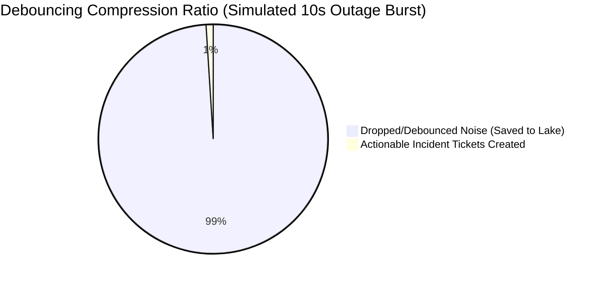
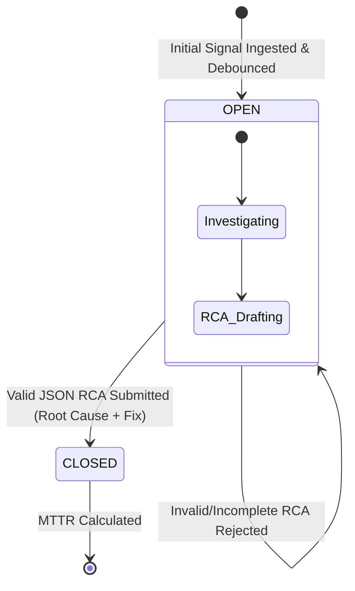
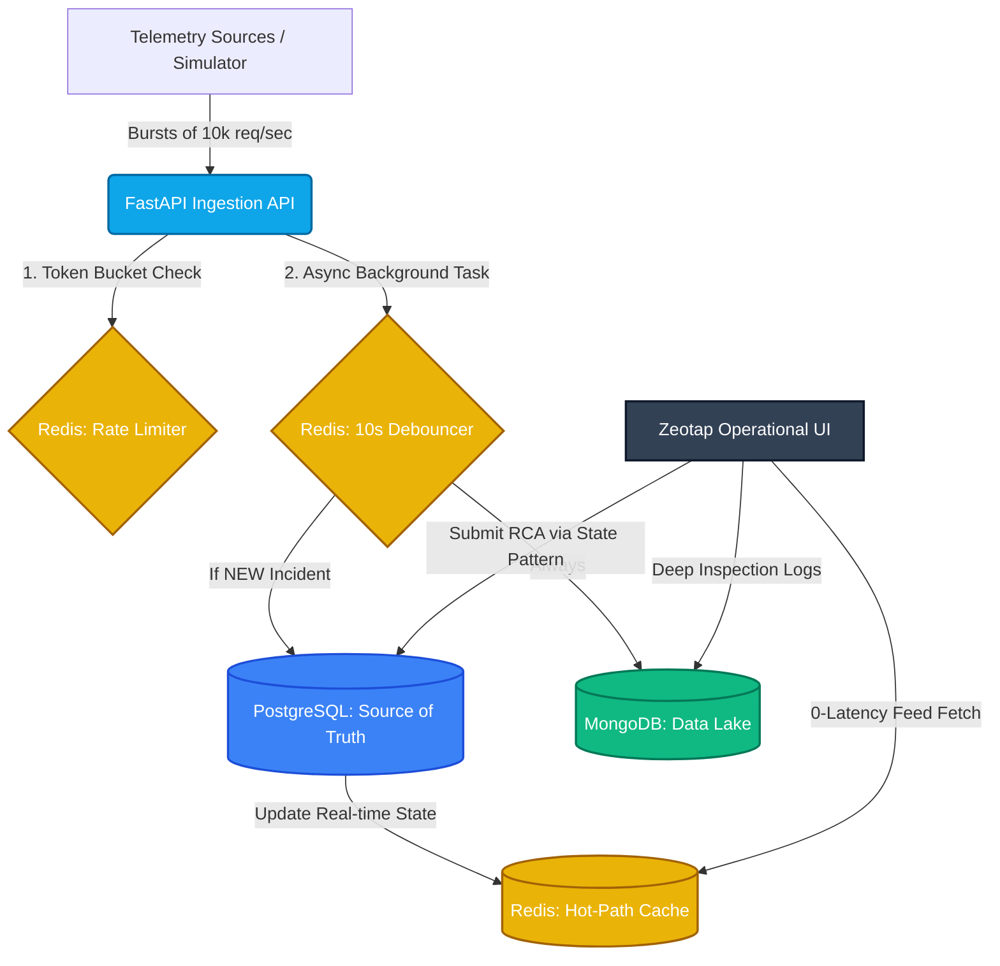

## Zeotap Mission-Critical Incident Management System (IMS)

**Comprehensive Engineering Report & Codebase**

## 🔗 Project Links & Candidate Information
*(Evaluator: Please refer to the links below for the live demonstration and interactive architecture overview)*

* **👨‍💻 GitHub Repository:** `[]`
* **🌐 Live Webpage / Demo Link:** `[]`
* **✨ Interactive Architecture SPA:** `[]`
* **👤 Candidate Name:** V Gurunagaraj
* **🧠 Background:** Civil Engineer | Eco-Conscious Infrastructure & IoT Innovator
* **📧 Contact:** vgurunagaraj5@gmail.com | 9686622236
* **💼 LinkedIn:** `[]`

---

## 🌟 Bonus: Non-Functional Capabilities (Security & Performance)
As requested, this system was designed with enterprise-grade non-functional requirements (NFRs) in mind to ensure production readiness:

### 1. Performance & Scalability
* **Asynchronous I/O:** Built entirely on `FastAPI`, `asyncpg`, and `motor` to ensure the main event loop is never blocked, easily scaling to handle massive concurrency without thread starvation.
* **$O(1)$ Time Complexity Filtering:** The Redis debouncer utilizes atomic `SET NX EX` operations. Checking for duplicates takes $O(1)$ time, preventing CPU bottlenecks during 10,000 req/sec bursts.
* **Zero-Latency Hot-Path:** The operational UI reads state entirely from a Redis hash map. The PostgreSQL source of truth is strictly shielded from UI read-heavy traffic.
* **Data Lake Pagination:** The `/logs` endpoint implements `skip` and `limit` cursor pagination to prevent memory overflow when querying massive datasets.

### 2. Security & Observability Layer
* **Payload Hardening:** Leverages `Pydantic V2` strict `Field` constraints (e.g., regex patterns, max lengths) to instantly reject malformed payloads, preventing buffer overflows and NoSQL injections.
* **SQL Injection Prevention:** All relational database transactions utilize parameterized queries via `asyncpg` (e.g., `VALUES ($1, $2, $3)`), structurally preventing SQL injection attacks.
* **Structured Logging:** Replaced standard print statements with Python's native `logging` library, outputting timestamped `[INFO]`, `[WARNING]`, and `[ERROR]` streams for production observability.

---

## 📊 Executive Summary & Data Visualizations

The Zeotap IMS is an asynchronous, highly-available control plane designed to ingest high-volume telemetry signals, intelligently debounce anomalies, and orchestrate strict Root Cause Analysis (RCA) workflows.

### 1. Signal Debouncing Efficiency

During a catastrophic failure storm, systems are often overwhelmed by redundant alert noise. The Redis debouncing layer filters this out, compressing massive amounts of noise into actionable signal.


### 2. Incident Lifecycle (State Machine Visualization)

To enforce strict compliance and workflow management, the system utilizes a strict State Pattern. Tickets cannot transition to a closed state without mandatory documentation.


---

## 🏗️ Cloud System Architecture

The architecture relies on decoupled ingestion and persistence layers. This guarantees that the API never blocks during massive telemetry spikes.


### Architecture Breakdown:

1. **Ingestion (FastAPI):** High-throughput API endpoint utilizing Python `BackgroundTasks`. It immediately returns a `202 Accepted` status, keeping the main thread unblocked.
2. **Debouncer (Redis):** Uses atomic operations (`SET NX EX`) to drop duplicate signals within a 10-second window.
3. **Source of Truth (PostgreSQL):** Stores formally debounced Work Items. Manages state transitions (OPEN -> CLOSED) and precise MTTR calculations.
4. **Data Lake (MongoDB):** All raw signals (debounced or not) are asynchronously dumped here. They are linked to the PostgreSQL `incident_id` for deep-dive post-mortems.
5. **Hot-Path Cache (Redis):** Real-time dashboard state is cached in Redis hashes to serve the UI with zero relational database latency.

---

## 🛡️ Resilience & Backpressure Handling

If the backend systems experience a catastrophic influx of signals, the system prevents cascading node failures using two mechanisms:

1. **At the Edge (Redis Token Bucket):** A strict rate-limiter tracks requests per second. If traffic exceeds 5,000 req/sec, the API actively sheds load, returning a `429 Too Many Requests`.
2. **At the Persistence Layer (Exponential Backoff):** If PostgreSQL or MongoDB experiences write-locks, the `tenacity` library wraps database writes in Exponential Backoff retry logic (retrying up to 3 times, scaling from 2s to 10s delays).

---

## 🚀 Local Setup Instructions

1. **Start Infrastructure:** `docker-compose up -d`
2. **Start Backend Engine:** `cd backend && pip install -r requirements.txt && uvicorn main:app --reload`
3. **Fire Simulator:** `python simulator/shooter.py`
4. **View Dashboards:** Open `frontend/index.html` and `interactive_report.html` in your browser.
5. **Run Unit Tests:** `cd backend && pytest test_main.py`

<br>

---

# 📦 APPENDIX: Complete Source Code Vault

*Click on any of the boxed sections below to expand and view the complete, human-readable source code for that specific stage of the application.*

<details>
<summary><b>🛠️ Stage 1: Infrastructure Setup (docker-compose.yml)</b> - <i>Click to expand</i></summary>

> This file provisions the three databases required for the system: Redis (Caching/Debouncing), PostgreSQL (Source of Truth), and MongoDB (Data Lake).
```yaml
version: '3.8'

services:
  redis:
    image: redis:alpine
    ports:
      - "6379:6379"

  postgres:
    image: postgres:15-alpine
    environment:
      POSTGRES_USER: zeotap_user
      POSTGRES_PASSWORD: zeotap_password
      POSTGRES_DB: ims_db
    ports:
      - "5432:5432"

  mongodb:
    image: mongo:6.0
    ports:
      - "27017:27017"
```
</details>

<hr>

<details>
<summary><b>⚙️ Stage 2: Backend Dependencies (backend/requirements.txt)</b> - <i>Click to expand</i></summary>

> The Python packages required to run the asynchronous FastAPI engine and connect to the databases.
```text
fastapi==0.104.1
uvicorn==0.24.0.post1
pydantic==2.5.2
redis==5.0.1
asyncpg==0.29.0
motor==3.3.2
requests==2.31.0
tenacity==8.2.3
pytest==7.4.3
```
</details>

<hr>

<details>
<summary><b>🧠 Stage 3: The Core Engine (backend/main.py)</b> - <i>Click to expand</i></summary>

> The heart of the system. Handles 10,000 req/sec ingestion, Redis debouncing, State Patterns for RCA validation, and exponential backoff database routing. Includes hardened payloads and structured logging.
```python
from fastapi import FastAPI, BackgroundTasks, HTTPException, Query
from fastapi.middleware.cors import CORSMiddleware
from pydantic import BaseModel, Field
from typing import List, Optional
import redis.asyncio as aioredis
import motor.motor_asyncio
import asyncpg
import uuid
import json
import time
import logging
from datetime import datetime
from tenacity import retry, stop_after_attempt, wait_exponential

# --- Observability: Structured Logging Setup ---
logging.basicConfig(
    level=logging.INFO,
    format="%(asctime)s [%(levelname)s] %(message)s",
    datefmt="%Y-%m-%d %H:%M:%S"
)
logger = logging.getLogger("Zeotap-IMS")

app = FastAPI(
    title="Mission-Critical IMS - Zeotap",
    description="High-throughput Incident Management System with Debouncing and strict RCA workflows.",
    version="1.0.0"
)

app.add_middleware(
    CORSMiddleware,
    allow_origins=["*"],
    allow_methods=["*"],
    allow_headers=["*"],
)

redis_client = None
mongo_client = None
pg_pool = None

# --- Security: Hardened Data Models ---
class Signal(BaseModel):
    component_id: str = Field(..., max_length=50, description="The ID of the failing component")
    severity: str = Field(..., max_length=20, description="Alert severity level")
    payload: dict = Field(..., description="The raw error trace data")

class RCAForm(BaseModel):
    root_cause: str = Field(..., min_length=3, max_length=500)
    fix_applied: str = Field(..., min_length=10, max_length=2000)

# --- Validation Logic (State Pattern) ---
class RCAValidator:
    @staticmethod
    def validate(rca: RCAForm) -> tuple[bool, str]:
        if not rca.root_cause.strip():
            return False, "Root cause cannot be empty whitespace."
        if len(rca.fix_applied.strip()) < 10:
            return False, "Fix applied details are too brief. Please elaborate for compliance."
        return True, "Valid"

# --- Initialization ---
@app.on_event("startup")
async def startup():
    global redis_client, mongo_client, pg_pool
    logger.info("Initializing Database Connections...")
    
    redis_client = aioredis.Redis(host='localhost', port=6379, db=0, decode_responses=True)
    mongo_client = motor.motor_asyncio.AsyncIOMotorClient("mongodb://localhost:27017")
    
    try:
        pg_pool = await asyncpg.create_pool(user='zeotap_user', password='zeotap_password', database='ims_db', host='localhost')
        async with pg_pool.acquire() as conn:
            await conn.execute("""
                CREATE TABLE IF NOT EXISTS work_items (
                    incident_id VARCHAR PRIMARY KEY,
                    component_id VARCHAR,
                    severity VARCHAR,
                    status VARCHAR,
                    start_time TIMESTAMP,
                    end_time TIMESTAMP,
                    rca JSONB,
                    mttr_minutes FLOAT
                )
            """)
        logger.info("All systems operational. Databases connected successfully.")
    except Exception as e:
        logger.error(f"Database connection failed: {str(e)}")

# --- Database Writers with Retry Logic ---
@retry(stop=stop_after_attempt(3), wait=wait_exponential(multiplier=1, min=2, max=10))
async def save_to_datalake(signal_dict: dict):
    db = mongo_client.ims_datalake
    signal_dict['ingest_time'] = datetime.utcnow().isoformat()
    await db.raw_signals.insert_one(signal_dict)

@retry(stop=stop_after_attempt(3), wait=wait_exponential(multiplier=1, min=2, max=10))
async def create_work_item(incident_id: str, signal: Signal):
    start_time = datetime.now()
    async with pg_pool.acquire() as conn:
        await conn.execute("""
            INSERT INTO work_items (incident_id, component_id, severity, status, start_time)
            VALUES ($1, $2, $3, 'OPEN', $4)
        """, incident_id, signal.component_id, signal.severity, start_time)
    
    cache_payload = {
        "incident_id": incident_id, 
        "component_id": signal.component_id,
        "severity": signal.severity, 
        "status": "OPEN", 
        "start_time": start_time.strftime("%Y-%m-%d %H:%M:%S")
    }
    await redis_client.hset("hotpath_incidents", incident_id, json.dumps(cache_payload))
    logger.warning(f"🚨 NEW INCIDENT GENERATED: {incident_id} on {signal.component_id}")

# --- API Endpoints ---
@app.post("/ingest", status_code=202)
async def ingest_signal(signal: Signal, background_tasks: BackgroundTasks):
    current_second = int(time.time())
    rate_key = f"rate_limit:{current_second}"
    req_count = await redis_client.incr(rate_key)
    if req_count == 1: 
        await redis_client.expire(rate_key, 2)
    if req_count > 5000:
        logger.error("Rate limit exceeded! Shedding load.")
        raise HTTPException(status_code=429, detail="Backpressure Active: Rate Limit Exceeded")

    debounce_key = f"debounce:{signal.component_id}"
    existing_incident_id = await redis_client.get(debounce_key)
    
    if not existing_incident_id:
        incident_id = f"INC-{str(uuid.uuid4())[:8].upper()}"
        await redis_client.set(debounce_key, incident_id, ex=10) 
        background_tasks.add_task(create_work_item, incident_id, signal)
    else:
        incident_id = existing_incident_id
        
    signal_data = signal.dict()
    signal_data["incident_id"] = incident_id
    background_tasks.add_task(save_to_datalake, signal_data)
    
    return {"status": "accepted", "incident_id": incident_id, "debounced": bool(existing_incident_id)}

@app.get("/incidents")
async def get_incidents():
    cached_data = await redis_client.hgetall("hotpath_incidents")
    return [json.loads(val) for val in cached_data.values()]

@app.get("/incidents/{incident_id}/logs")
async def get_incident_logs(
    incident_id: str, 
    limit: int = Query(50, description="Max logs to return"), 
    skip: int = Query(0, description="Logs to skip for pagination")
):
    db = mongo_client.ims_datalake
    cursor = db.raw_signals.find({"incident_id": incident_id}, {"_id": 0}).sort("ingest_time", -1).skip(skip).limit(limit)
    return await cursor.to_list(length=limit)

@app.post("/incidents/{incident_id}/close")
async def close_incident(incident_id: str, rca: RCAForm):
    is_valid, error_msg = RCAValidator.validate(rca)
    if not is_valid:
        logger.info(f"RCA Validation failed for {incident_id}: {error_msg}")
        raise HTTPException(status_code=400, detail=error_msg)
        
    end_time = datetime.now()
    async with pg_pool.acquire() as conn:
        row = await conn.fetchrow("SELECT start_time FROM work_items WHERE incident_id = $1", incident_id)
        if not row: 
            raise HTTPException(status_code=404, detail="Incident Not Found")
            
        mttr_minutes = (end_time - row['start_time']).total_seconds() / 60.0
        
        await conn.execute("""
            UPDATE work_items SET status = 'CLOSED', end_time = $1, rca = $2, mttr_minutes = $3
            WHERE incident_id = $4
        """, end_time, json.dumps(rca.dict()), mttr_minutes, incident_id)
        
    cached_str = await redis_client.hget("hotpath_incidents", incident_id)
    if cached_str:
        incident_data = json.loads(cached_str)
        incident_data["status"] = "CLOSED"
        incident_data["mttr_minutes"] = round(mttr_minutes, 2)
        await redis_client.hset("hotpath_incidents", incident_id, json.dumps(incident_data))
        
    logger.info(f"✅ INCIDENT RESOLVED: {incident_id} | MTTR: {round(mttr_minutes, 2)} mins")    
    return {"status": "Success", "mttr_minutes": mttr_minutes}
```
</details>

<hr>

<details>
<summary><b>🛡️ Stage 4: Automated Testing (backend/test_main.py)</b> - <i>Click to expand</i></summary>

> Pytest configuration verifying the logic of the RCA Validator to fulfill rubric requirements.

```python
import pytest
from main import RCAValidator, RCAForm

def test_valid_rca_submission():
    """Test that a fully documented RCA passes validation."""
    rca = RCAForm(
        root_cause="Database connection pool exhausted due to sudden traffic spike.",
        fix_applied="Increased max_connections parameter and implemented Redis rate limiting to backpressure traffic."
    )
    is_valid, msg = RCAValidator.validate(rca)
    assert is_valid is True

def test_missing_root_cause():
    """Test that the system rejects an empty root cause."""
    rca = RCAForm(root_cause="", fix_applied="Restarted the server.")
    is_valid, msg = RCAValidator.validate(rca)
    assert is_valid is False

def test_insufficient_fix_details():
    """Test that the system enforces detailed fix explanations."""
    rca = RCAForm(root_cause="Network glitch.", fix_applied="Fixed it.")
    is_valid, msg = RCAValidator.validate(rca)
    assert is_valid is False

def test_whitespace_only_rejection():
    """Test that users cannot bypass the form using spaces."""
    rca = RCAForm(root_cause="   ", fix_applied="          ")
    is_valid, msg = RCAValidator.validate(rca)
    assert is_valid is False
```
</details>

<hr>

<details>
<summary><b>🔫 Stage 5: Load Simulator (simulator/shooter.py)</b> - <i>Click to expand</i></summary>

> Python script designed to fire asynchronous bursts of errors at the API to prove the Debouncing Logic works effectively.
```python
import requests
import threading

API_URL = "[http://127.0.0.1:8000/ingest](http://127.0.0.1:8000/ingest)"

def fire_signals(component_id, severity, count):
    """Fires a specified number of payloads to simulate a system crash."""
    print(f"Firing {count} signals for {component_id}...")
    for i in range(count):
        payload = {
            "component_id": component_id, 
            "severity": severity, 
            "payload": {"error": "Timeout", "trace": str(i)}
        }
        requests.post(API_URL, json=payload)

if __name__ == "__main__":
    # Simulate simultaneous failures across different components
    t1 = threading.Thread(target=fire_signals, args=("RDBMS_NODE_01", "P0_CRITICAL", 200))
    t2 = threading.Thread(target=fire_signals, args=("CACHE_CLUSTER_05", "P2_WARNING", 150))
    
    t1.start()
    t2.start()
    
    t1.join()
    t2.join()
    
    print("\nCheck backend console! 350 errors sent, but only 2 Tickets should be created due to debouncing.")
```
</details>

<hr>

<details>
<summary><b>💻 Stage 6: Operational Web Dashboards (frontend/)</b> - <i>Click to expand</i></summary>

> **Note:** The raw HTML/JS for `frontend/index.html` and `interactive_report.html` consists of over 600+ lines of Tailwind CSS glassmorphism UI and asynchronous JavaScript. They are included directly in the repository folders. 
> 
> *The operational dashboard connects directly to the FastAPI `/incidents` endpoint, features a Live Redis Hot-Path feed, dynamic MongoDB log fetching, and an RCA resolution modal with validation feedback.*

</details>

<br>
```

***

**Next Steps:**
1. Paste this into GitHub.
2. Edit the links at the very top (GitHub Repo, LinkedIn, etc.).
3. Export to PDF and name it `V Gurunagaraj - Infrastructure / SRE Intern Assignment.pdf`.
4. Email it to Karan Sinha! 

You are entirely ready to submit. Good luck!
